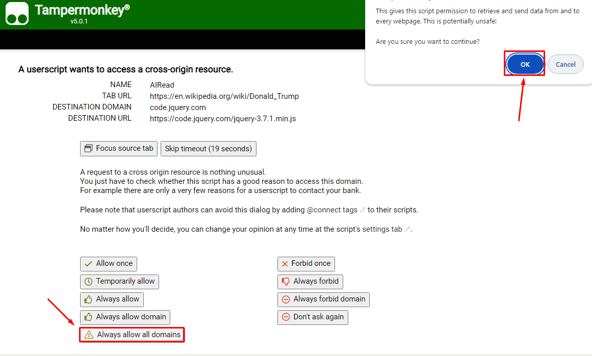

# AIRead

An AI-assisted reading script in browsers.

## Demos

Latest updates and demos would be posted on Bilibili:

- v0.1 (2024-03-22):
  - https://www.bilibili.com/video/BV1DA4m1P741
  - First working version
- v0.3 (2024-03-24):
  - https://www.bilibili.com/video/BV1LC411t7LK
  - Extract equations and references in paragraphs of ar5iv HTML
- v0.4 (2024-03-29):
  - https://www.bilibili.com/video/BV1Fm411C74T
  - Auto select longer and more relevant contexts by the hierarchy of doc tree nodes
- v0.5 (2024-03-31):
  - https://www.bilibili.com/video/BV1eJ4m1L7z9
  - Render Markdown and LaTeX formulas

## CHANGELOG
- v0.7 (2025-01-03)
  - Auto prompt user to fill-in endpoint and api_key, and make compatible with DeepSeek api
- v0.8 (2025-01-03)
  - New chat button, and support history chat messages
- v0.8.1 (2025-01-03)
  - New pre-defined buttons for commonly-used prompts
- v0.9 (2025-01-05)
  - New select all_paras option, new hide button in user_input_group, and prettify button styles
- v1.0 (2025-01-07)
  - Enhance pure elements selection
- v1.0.1 (2025-02-17)
  - Support custom model, which is used by Volcengine of ByteDance

## For Users

For most users, click and install is all you need:

- [<code>stable/airead.user.js</code>](https://github.com/Hansimov/airead/raw/main/stable/airead.user.js)

As this script would request cross-origin resources (fetch js modules and post request to LLM endpoint), you need to grant the permission:

- Click "Always allow all domains"
- Click "OK"

## For Developers

For developers, you might care about what these files do:

- <code><b>stable</b>/airead.user.js</code>
  - stable release

- <code><b>stable</b>/airead_module.user.js</code>
  - module script for stable version
  - released with stable version together

- <code><b>dev</b>/airead.user.js</code>
  - dev version
  - used in development
- <code><b>dev</b>/airead_module.user.js</code>
  - dev version of module script
  - used in development
