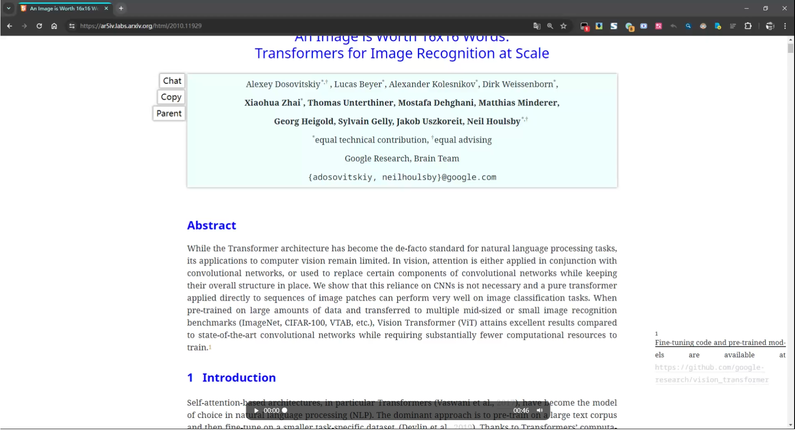

# AIRead
An AI-assisted reading script in browsers.

## Demo

## Scripts

Currently there are 4 files:

- airead.**stable**.user.js`
  - Stable release with pinned versions
  - Recommend for most users
- airead.**latest**.user.js`
  - Latest release with latest versions of modules
  - Recommend for active testers and brave users
- airead.**local**.user.js`
  - Quick develop and test in local environments
  - For developers
- `airead.user.js`
  - The module which is required by above scripts